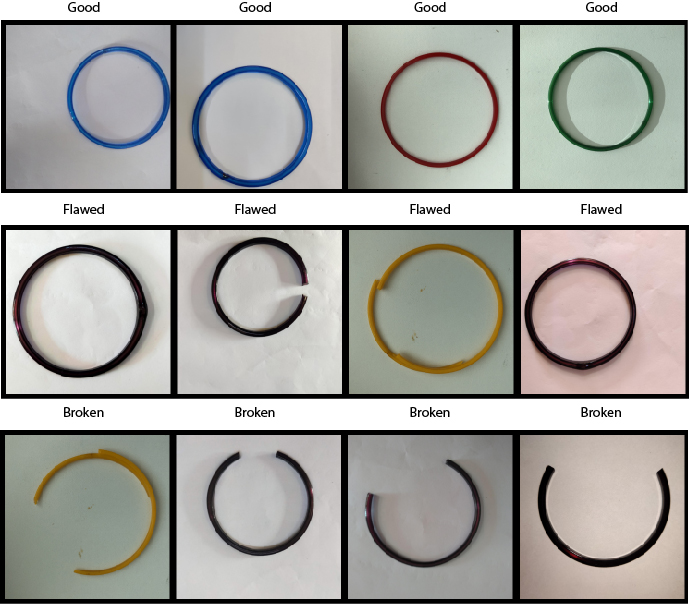
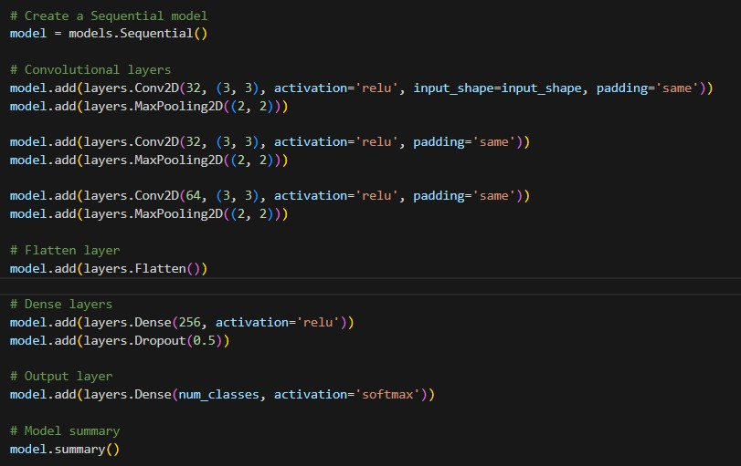
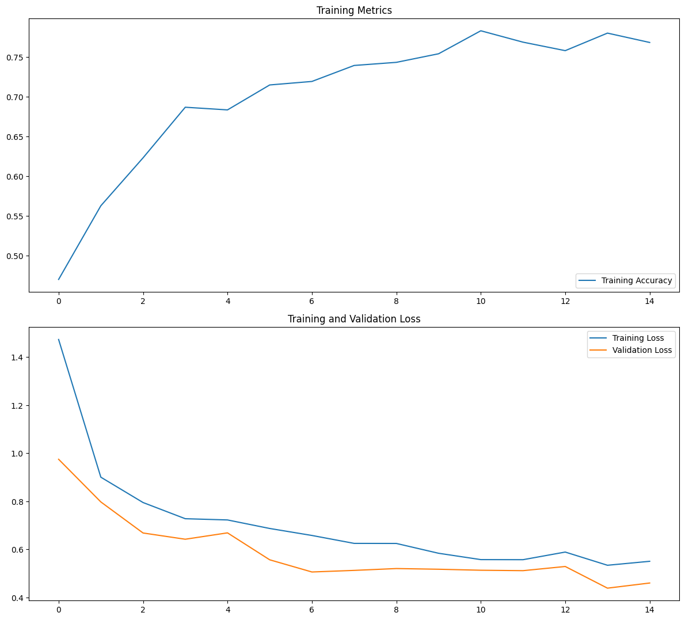
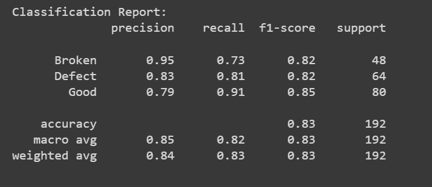
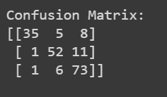
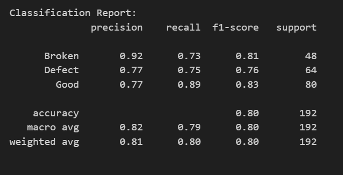
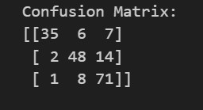

## Project Overview
<h3 align="center" style=" line-height: 1.3;">
The project provides an end-to-end pipeline for building a quality inspection vision system in Tensorflow-Keras for manufactured products.

It scales up to the possibility of inspecting the quality of products passing in a conveyor belt in a production line.

The Github Repo for the Django Project can be accessed at <a >https://github.com/Hypatchia/QualityInspection-Images-Django</a>
</h3>

## Built with:

## Methodology:

- Load 3 classes dataset into train, validation & test
- Preprocess Images
- Augment Dataset
- Build, Train & Optimize a Multiclss CNN.
- Evaluate Quality of Training
- Optimize the model for size and speed using weight clustering.
- Save & Integrate the resulting model into a Django WebApp.

## Dataset

The CNN model was trained on a dataset of product images belonging to 3 classes: **Broken {0} - Flawed {1} - Good {2}**

The structure of the dataset is as follows: 

## Image Processing:
To prepare the images for training and prediction, the following processing steps were performed:

* Images were loaded into their respective training and validation directories using TensorFlow data generator.
* Resizing: Images were resized to a consistent size to ensure uniform input for the neural network.
* Dataset Augmentation: Fundmental Augmentation was applied.

## Training a Convolutional Neural Network for Multiclass Image Classification

A Convolutional Neural Network (CNN) was designed to perform the multiclass classification. The CNN is trained on the labeled dataset, learning to distinguish between good, broken and flawed products.

The CNN architecture includes convolutional layers, pooling layers, and fully connected layers.

  

## Model Evaluation:

To evaluate the performance of the trained model and ensure its accuracy and reliability in predicting product defects, the metrics used were the classification report: accuracy, recall, f1 score and precision.

 <li> The Training, Validation Loss and Training Metrics are shown in the figure:</li>

  

 <li> The Evaluation Metrics on Newly Unseen Data gave the Classification Report: </li>

  

 <li> The Evaluation Metrics on Newly Unseen Data gave the Confusion Matrix </li>

  

## Model Compression: Weight Clustering:

The weight Clustered & FineTuned Model resulted in the following metrics:

 <li> The Evaluation Metrics on Newly Unseen Data gave the Classification Report: </li>

  

 <li> The Evaluation Metrics on Newly Unseen Data gave the Confusion Matrix </li>

  

## Web App

A defect assessment web system was built using Django that allows the upload of an image of a product, processing, and then prediction of its status with respective probabilities.

The process includes loading the pretrained deep learning model from Azure Blob storage, preprocessing the image, and then making the final prediction of the product's status as "broken","flawed","good"

A screenshot of the app is available:

The app can be accessed at [https://productinspection.azurewebsites.net/](https://productinspection.azurewebsites.net/).

## Deployment

The final web application has been deployed on Azure App Services, ensuring scalability and reliability. Azure - Blob Containers are used for storing deep learning models and product images for seamless integration with the web application.

## Setup to run

To run the project, follow these steps:

* Clone the Repository
* Navigate to the project directory
* Create a Virtual Environment and Activate it
* Install requirements
* You can then either:
    * Navigate to /Pipeline/ & run 
    ~~~
    python main.py
    ~~~
    * navigate to /Notebooks/ & Run The Jupyter Notebook.

## Contact
 Feel free to reach out to me on LinkedIn or through email & don't forget to visit my portfolio.
 

